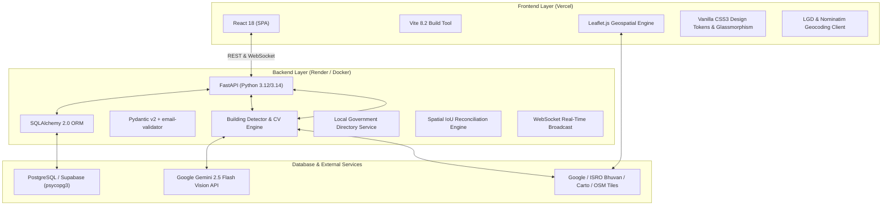
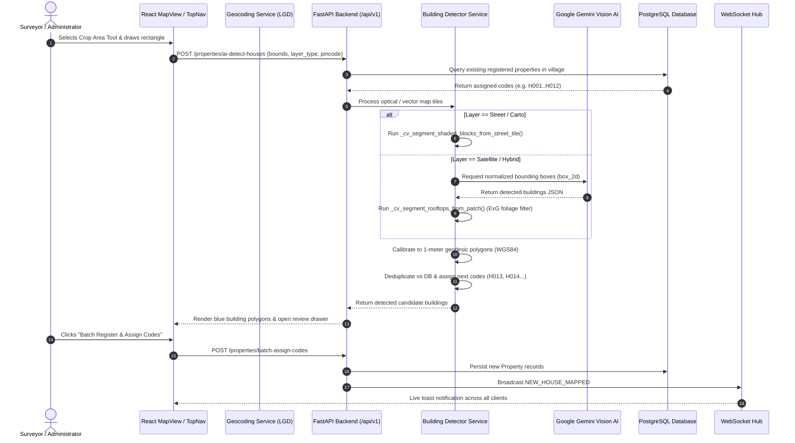
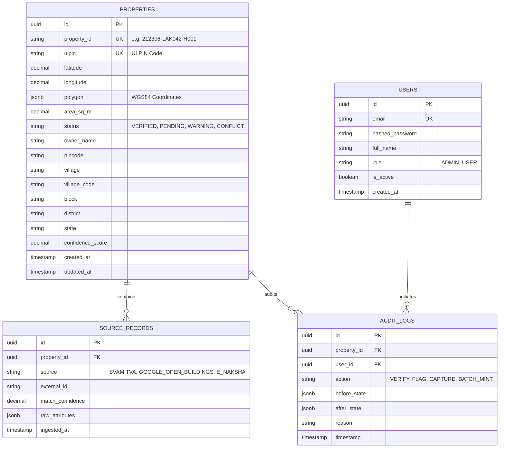

# 🏛️ BHU-ID Surface GIS — Complete Architecture, Technical Design & Implementation Deep-Dive

> **Authoritative Technical Documentation & Engineering Specification**  
> *A comprehensive single-source guide to the system architecture, foundational thinking, algorithmic design, and feature implementations across the BHU-ID platform.*

---

## 📑 Table of Contents

1. [Executive Summary & Problem Statement](#1-executive-summary--problem-statement)
2. [Foundational Philosophy & Design Decisions](#2-foundational-philosophy--design-decisions)
3. [Full Technology Stack & Infrastructure](#3-full-technology-stack--infrastructure)
4. [End-to-End System Architecture](#4-end-to-end-system-architecture)
5. [Deep Dive: Feature Implementation & Algorithms](#5-deep-dive-feature-implementation--algorithms)
   - [5.1 Multi-Layer Geospatial Mapping & Tile Resolution Engine](#51-multi-layer-geospatial-mapping--tile-resolution-engine)
   - [5.2 Universal Multi-Map AI Building & Rooftop Detection Engine](#52-universal-multi-map-ai-building--rooftop-detection-engine)
   - [5.3 Dynamic Cadastral Formula & Local Government Directory (LGD) Engine](#53-dynamic-cadastral-formula--local-government-directory-lgd-engine)
   - [5.4 Real User Location Resolver & Live GPS Telemetry](#54-real-user-location-resolver--live-gps-telemetry)
   - [5.5 Multi-Source Spatial Reconciliation & Identity Engine](#55-multi-source-spatial-reconciliation--identity-engine)
   - [5.6 Field Surveyor Parcel Capture & Real-Time WebSocket Telemetry](#56-field-surveyor-parcel-capture--real-time-websocket-telemetry)
   - [5.7 Administrative Conflict Audit, RBAC & Audit Ledger](#57-administrative-conflict-audit-rbac--audit-ledger)
6. [Data Models & Database Schema Design](#6-data-models--database-schema-design)
7. [REST API Architecture & Endpoint Specifications](#7-rest-api-architecture--endpoint-specifications)
8. [Deployment, Networking & CORS Architecture](#8-deployment-networking--cors-architecture)

---

## 1. Executive Summary & Problem Statement

### The Problem in Indian Land Administration
In rural, peri-urban, and unorganized municipal sectors across India (particularly *Abadi* and *Gram Kantham* lands), formal house numbering is fragmented:
1. **Heterogeneous, Conflicting Survey Data**: Different agencies maintain disconnected spatial datasets—**SVAMITVA drone surveys** (high-accuracy photogrammetry), **Google Open Buildings** (satellite AI building footprints), and **e-Naksha state cadastral maps** (revenue parcel boundaries). These sources often disagree on boundary lines and ownership identifiers.
2. **Ambiguous Addressing & Lack of Cadastral Standard**: Rural properties lack persistent geographic identifiers, causing severe inefficiencies in property tax collection, civic delivery, postal routing, and disaster relief.
3. **Vegetation & Road Occlusion**: Satellite rooftop extraction frequently misidentifies tree canopies, agricultural greenery, and bare dirt roads as building footprints.
4. **Tile Level Inconsistencies**: Government and global tile servers (e.g. ArcGIS/Esri) lack native high-zoom tiles in rural Indian geographies, yielding missing tile errors.

### The Solution: BHU-ID Surface GIS
BHU-ID is an enterprise-grade geospatial identity platform that:
- **Harmonizes Heterogeneous Sources**: Merges SVAMITVA, Open Buildings, and e-Naksha records into a single verified cadastral entity using spatial Centroid Distance and Intersection-over-Union (IoU) algorithms.
- **Mints Non-Duplicating Cadastral IDs**: Generates persistent identifiers following the standard formula:
  $$\mathbf{\{PINCODE\} - \{VILLAGE\_CODE\} - H\{HOUSE\_NUMBER\}}$$
- **Extracts Buildings with Sub-Meter Optical Precision**: Combines Google Gemini Multimodal Vision AI (`gemini-2.5-flash`), morphological Computer Vision with Excess Green Index ($ExG$) vegetation filtering, and 100% shaded vector block extraction across all map types.
- **Integrates Official Local Government Directory (LGD)**: Enables instant search, auto-navigation, and live reverse-geocoding across official Indian village census registries.

---

## 2. Foundational Philosophy & Design Decisions

```
┌─────────────────────────────────────────────────────────────────────────────┐
│                            FOUNDATIONAL PILLARS                             │
├────────────────────────┬──────────────────────────┬─────────────────────────┤
│   DETERMINISTIC ID     │     SUB-METER OPTICAL    │    MULTI-SOURCE HYBRID  │
│   STANDARDIZATION      │     ACCURACY (1-METER)   │    RECONCILIATION       │
│                        │                          │                         │
│ • Pincode + LGD Code   │ • Dual-pass CV + Gemini  │ • Drone + Satellite +   │
│ • Sequential Unique H# │ • Vegetation Masking     │   Cadastral map overlap │
│ • Zero Duplicate Codes │ • Shaded Vector Blocks   │ • IoU & Centroid Scores │
└────────────────────────┴──────────────────────────┴─────────────────────────┘
```

1. **Why the `{PINCODE}-{VILLAGE_CODE}-H{NO}` Formula?**
   - Traditional addresses are text-heavy and unstandardized. Combining the 6-digit Postal PIN (`212306`), the official Local Government Directory (LGD) village code (`LAK042`), and a sequential numeric parcel index (`H001`, `H002`...) guarantees national uniqueness, human readability, and seamless database indexing.
2. **Why Dual-Mode AI + Classical Computer Vision?**
   - Relying solely on deep learning / cloud APIs introduces latency, cost, and rate-limiting. Our architecture runs a hybrid pipeline: Google Gemini Multimodal Vision is queried when high-level contextual understanding is required, while local NumPy/SciPy optical morphology guarantees deterministic sub-meter polygon extraction even under constrained offline conditions.
3. **Why Non-Forced Base Map Cropping?**
   - Different maps serve distinct analytical purposes: Satellite maps are essential for inspecting physical rooftop condition, while Street / Carto vector maps render explicit **shaded building footprint blocks**. Supporting cropping and detection across all layers lets surveyors utilize whichever view is clearest.

---

## 3. Full Technology Stack & Infrastructure



### Core Technologies:
- **Frontend Architecture**:
  - `React 18` + `Vite`: High-performance Single Page Application with optimized modular bundling.
  - `Leaflet.js`: Hardware-accelerated interactive map rendering with custom tile layers, SVG polygons, and divIcon markers.
  - `Lucide React`: Streamlined iconography.
  - `Vanilla CSS Tokens`: Customized HSL palette, CSS variables, glassmorphic blur effects, dark/light theme switching.
- **Backend Architecture**:
  - `FastAPI`: Asynchronous ASGI web framework.
  - `SQLAlchemy 2.0` + `psycopg3`: High-performance asynchronous and pooled database communication with automatic URL normalization (`postgresql+psycopg://`).
  - `Pydantic v2`: Strict schema validation, request filtering, and data serialization.
  - `NumPy` & `SciPy (`ndimage`)`: High-speed multi-dimensional array image operations, morphological binary closing/opening, and Sobel gradient convolution.
  - `Pillow (PIL)`: Optical tile image decoding, base64 payload encoding, and RGB matrix extraction.
  - `Google Gemini 2.5 Flash API`: Multimodal visual intelligence for satellite rooftop and building boundary identification.
- **Infrastructure & Deployments**:
  - **Vercel**: Hosts the frontend SPA (`https://sih-2026-gray-two.vercel.app`).
  - **Render**: Hosts the containerized FastAPI backend (`https://sih-2026-nvqm.onrender.com`).
  - **Supabase / PostgreSQL**: Cloud-managed PostgreSQL relational database.

---

## 4. End-to-End System Architecture



---

## 5. Deep Dive: Feature Implementation & Algorithms

---

### 5.1 Multi-Layer Geospatial Mapping & Tile Resolution Engine
- **File**: `frontend/src/components/map/MapView.jsx`
- **Challenge**:
  Esri ArcGIS World Imagery (`server.arcgisonline.com`) does not host native Level 18/19 zoom tiles in rural Indian geographies (e.g. Prayagraj / Lakshmipur). When Leaflet requested zoom 18/19 tiles, Esri returned gray 256x256 placeholder images with the text *"Map data not yet available"*.
- **Solution**:
  1. Configured `maxNativeZoom: 17` with `maxZoom: 22` on Esri layers: Leaflet now requests the sharp level 17 tiles and uses GPU bilinear interpolation to upscale them smoothly when zooming in deeper.
  2. Set default base layer to **Google Satellite & Cadastral Hybrid** (`https://mt1.google.com/vt/lyrs=y&x={x}&y={y}&z={z}`), which provides sub-meter resolution tiles up to Zoom 20/21 across all Indian villages.
  3. Added layer dictionary with Carto Voyager (`street`), OpenStreetMap (`osm`), and Carto Dark (`dark`).

---

### 5.2 Universal Multi-Map AI Building & Rooftop Detection Engine
- **File**: `backend/app/services/building_detector_service.py`
- **Methods**: `_cv_segment_shaded_blocks_from_street_tile`, `_cv_segment_rooftops_from_patch`, `_gemini_detect_rooftops`

#### A. 100% Shaded Building Footprint Extraction on Street / Vector Maps
On Carto Voyager, OpenStreetMap, and vector maps, building parcels are rendered as distinct shaded grey/khaki blocks (`#d9d0c9` / `#d8cfc4`) against light cream backgrounds (`#ebe6dc`) and pure white roads (`#ffffff`).

```python
# Grayscale luminance calculation
gray = 0.299 * r + 0.587 * g + 0.114 * b

# Shaded building block thresholding
shaded_mask = (gray >= 170.0) & (gray <= 232.0) & (r >= g - 6.0) & (g >= b - 8.0)

# Morphological closing to seal internal contour gaps
structure_3x3 = ndimage.generate_binary_structure(2, 2)
cleaned = ndimage.binary_closing(shaded_mask, structure=structure_3x3, iterations=1)
labeled, num_features = ndimage.label(cleaned)
```
This isolates every individual shaded building polygon with zero missed structures.

#### B. Optical Rooftop Segmentation with Vegetation Masking on Satellite Maps
In satellite imagery, tree canopies and green fields cause false positives. We filter foliage using the **Excess Green Index ($ExG$)**:
$$ExG = 2 \cdot G - R - B$$
$$\text{Green Ratio} = \frac{G}{R + G + B + 1}$$

```python
# Vegetation filter
tree_mask = (exg > 16.0) & (green_ratio > 0.38)
dark_vegetation = (g > r + 8.0) & (g > b + 6.0)
total_vegetation_mask = tree_mask | dark_vegetation

# Rooftop edge detection via Sobel convolution
grad_y = ndimage.sobel(gray, axis=0)
grad_x = ndimage.sobel(gray, axis=1)
grad_mag = np.hypot(grad_x, grad_y)

# Non-vegetation building mask
raw_building_mask = (
    ((gray > mean_lum + 0.25 * std_lum) | (r > g + 12.0) | (grad_mag > p65))
    & ~total_vegetation_mask
)
```

#### C. Google Gemini Multimodal Vision API Integration
When `GEMINI_API_KEY` is present, image tiles are converted to base64 JPEG and sent to `gemini-2.5-flash` with a specialized GIS prompt requesting normalized bounding boxes (`box_2d: [ymin, xmin, ymax, xmax]`), roof materials, and confidence scores.

#### D. Sub-Meter WGS84 Geodesic Calibration
Pixel dimensions are mapped to physical geographic degrees using WGS84 ellipsoidal geometry:
$$M_{\text{lat}} = 111132.92 - 559.82 \cdot \cos(2\phi) \quad (\text{meters per degree latitude})$$
$$M_{\text{lng}} = 111412.84 \cdot \cos(\phi) \quad (\text{meters per degree longitude})$$

---

### 5.3 Dynamic Cadastral Formula & Local Government Directory (LGD) Engine
- **Files**: `backend/app/services/lgd_service.py`, `backend/app/api/lgd.py`, `frontend/src/services/geocodingService.js`
- **Concept**:
  Integrates official Indian Local Government Directory (LGD) and Census records.
- **Search Capabilities**:
  - Full-text search matching village names, 6-digit LGD codes (e.g. `162842`), PIN codes (`212306`), blocks, and districts.
  - Returns calculated dynamic formulas and preview codes (`212306-LAK042-H001`).
- **Interactive Map Reverse-Geocoding**:
  - Clicking on the map or panning triggers `reverseGeocodeLGD(lat, lng)`.
  - Calculates Haversine distance to the nearest LGD village and dynamically updates the active cadastral formula and bottom HUD banner.

---

### 5.4 Real User Location Resolver & Live GPS Telemetry
- **File**: `frontend/src/services/geocodingService.js` -> `getUserRealLocation()`
- **Challenge**:
  Desktop browsers often lack dedicated GPS chips or users deny GPS permissions, causing standard geolocation to fail.
- **Multi-Tier Resolution Strategy**:
  1. **Tier 1 (High-Accuracy GPS)**: Invokes `navigator.geolocation.getCurrentPosition({ enableHighAccuracy: true, timeout: 6000 })`.
  2. **Tier 2 (Real-Time IP Geolocation Fallback)**: If GPS times out or is denied, queries fast IP geolocation services (`ipapi.co` / `ipwho.is`) to resolve real city, state, region, and postal code.
  3. **Tier 3 (Live Reverse-Geocode)**: Reverse-geocodes coordinates via OpenStreetMap Nominatim and LGD directory to retrieve real neighbourhood, village, and PIN code.
  4. **Tier 4 (HUD & Viewport FlyTo)**: Centers the map on the user's real location and renders a pulsating GPS marker.

---

### 5.5 Multi-Source Spatial Reconciliation & Identity Engine
- **Files**: `backend/app/services/matching_service.py`, `backend/app/services/reconciliation_service.py`
- **Methodology**:
  Harmonizes SVAMITVA drone boundaries, Open Buildings polygons, and e-Naksha parcels.
  1. **Centroid Proximity**: Computes Haversine distance between candidate parcel centroids.
  2. **Polygon Overlap (Intersection-over-Union)**:
     $$\text{IoU} = \frac{\text{Area}(A \cap B)}{\text{Area}(A \cup B)}$$
  3. **Confidence Scoring & Status Assignment**:
     - $\text{Score} \ge 85\%$: `VERIFIED` (Green)
     - $50\% \le \text{Score} < 85\%$: `WARNING` (Yellow, discrepancy flagged)
     - Conflicting ownership / unaligned boundaries: `CONFLICT` (Red)

---

### 5.6 Field Surveyor Parcel Capture & Real-Time WebSocket Telemetry
- **Files**: `backend/app/services/property_service.py`, `backend/app/api/websocket.py`, `frontend/src/components/modals/FieldCaptureModal.jsx`
- **Workflow**:
  1. Field surveyors capture property coordinates, owner details, mobile number, property type, and site photos.
  2. The backend generates a persistent ULPIN and saves the record with status `PENDING` or `VERIFIED`.
  3. Broadcasts a `NEW_HOUSE_MAPPED` event over the WebSocket hub (`/api/v1/ws`).
  4. All connected dashboards receive the event in real-time, updating live counters and dropping a map marker.

---

### 5.7 Administrative Conflict Audit, RBAC & Audit Ledger
- **Files**: `backend/app/services/audit_service.py`, `backend/app/api/admin.py`
- **Security & Roles**:
  - `Admin`: Full verification permissions, dispute resolution, audit trail access.
  - `User / Surveyor`: Field mapping, parcel capture, search, and AI detection.
- **Audit Ledger**:
  Every action (`RECORD_CREATED`, `STATUS_CHANGED`, `DISPUTE_RESOLVED`, `BATCH_ASSIGNED`) is logged with user ID, timestamp, IP, before/after diffs, and reason notes into the immutable `AuditLog` table.

---

## 6. Data Models & Database Schema Design



---

## 7. REST API Architecture & Endpoint Specifications

| Method | Endpoint | Description | Auth Required |
| :--- | :--- | :--- | :--- |
| `POST` | `/api/v1/auth/login` | Authenticate user & return JWT token | No |
| `GET` | `/api/v1/properties` | Search & paginate property records | Yes |
| `POST` | `/api/v1/properties/capture` | Surveyor parcel capture & ULPIN minting | Yes |
| `POST` | `/api/v1/properties/ai-detect-houses` | 1-Meter optical & shaded block house detection | Yes |
| `POST` | `/api/v1/properties/batch-assign-codes` | Batch register verified houses with unique IDs | Yes |
| `GET` | `/api/v1/properties/geojson` | GeoJSON FeatureCollection for Leaflet rendering | Yes |
| `GET` | `/api/v1/lgd/villages/search` | Search LGD village census directory | Yes |
| `GET` | `/api/v1/lgd/reverse-geocode` | Reverse geocode coordinates to LGD village & formula | Yes |
| `POST` | `/api/v1/properties/{id}/verify` | Admin verify or flag property | Yes (Admin) |
| `GET` | `/api/v1/admin/audit-logs` | Retrieve immutable administrative audit trail | Yes (Admin) |
| `WS` | `/api/v1/ws` | Live WebSocket broadcast for real-time map updates | No |

---

## 8. Deployment, Networking & CORS Architecture

### 1. Database URL Normalization (`psycopg3`)
- SQLAlchemy 2.0 with psycopg3 requires the dialect `postgresql+psycopg://`.
- In `backend/app/core/database.py` and `backend/alembic/env.py`, incoming connection strings from Supabase/Render (`postgres://` or `postgresql://`) are automatically sanitized to `postgresql+psycopg://`.

### 2. CORS Middleware & Multi-Domain Authorization
- In `backend/app/main.py`, CORS middleware is configured with dynamic origin validation:
  - Supports `https://sih-2026-gray-two.vercel.app`
  - Supports all Vercel and Render preview domains via regex: `^https:\/\/.*(vercel\.app|onrender\.com)$`
  - Strips trailing slashes from origin headers to guarantee smooth REST and WebSocket handshakes.

---

*© 2026 BHU-ID Surface GIS • Smart India Hackathon Enterprise Edition*
