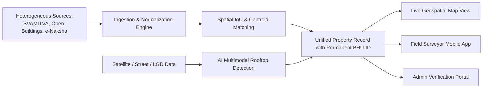
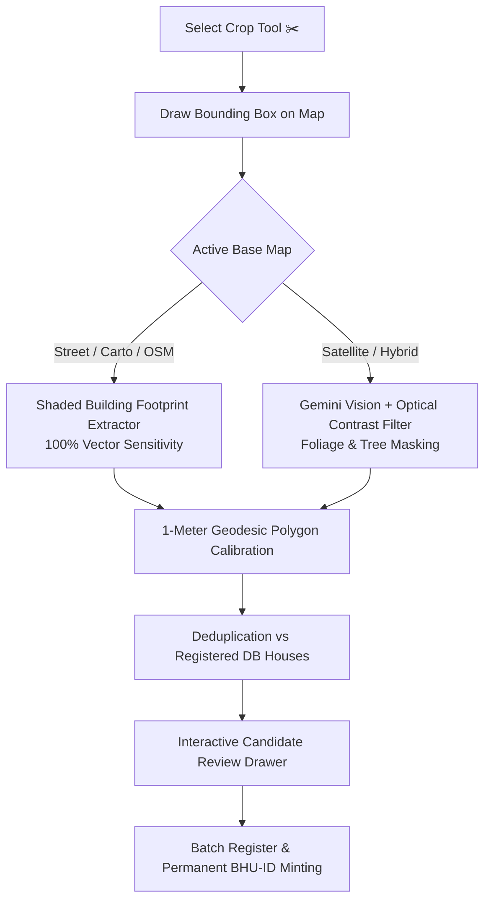

# 🏛️ BHU-ID Surface GIS — Comprehensive Platform & Feature Guide

> **Enterprise Geospatial Identity & Cadastral Mapping Platform**  
> *ULPIN-Ready Spatial Identity, Sub-Meter Optical Rooftop AI Detection, and Local Government Directory (LGD) Cadastral Engine.*

---

## 📑 Table of Contents

1. [Platform Overview & Architecture](#1-platform-overview--architecture)
2. [Feature 1: Interactive Multi-Layer Geospatial Map](#2-feature-1-interactive-multi-layer-geospatial-map)
3. [Feature 2: Universal Crop & AI House Detection Engine](#3-feature-2-universal-crop--ai-house-detection-engine)
4. [Feature 3: Dynamic Cadastral Formula & LGD Search Engine](#4-feature-3-dynamic-cadastral-formula--lgd-search-engine)
5. [Feature 4: Multi-Source Identity & Reconciliation Engine](#5-feature-4-multi-source-identity--reconciliation-engine)
6. [Feature 5: Field Surveyor Mobile Parcel Capture & Live WebSocket](#6-feature-5-field-surveyor-mobile-parcel-capture--live-websocket)
7. [Feature 6: Administrative Verification, Conflict Audit & RBAC](#7-feature-6-administrative-verification-conflict-audit--rbac)
8. [Feature 7: REST API & Integration Reference](#8-feature-7-rest-api--integration-reference)
9. [Best Practices for Maximizing Platform Value](#9-best-practices-for-maximizing-platform-value)

---

## 1. Platform Overview & Architecture

**BHU-ID Surface GIS** is designed for state revenue departments, municipal corporations, panchayats, and GIS survey teams to solve land identification, parcel overlap, and duplicate address challenges across India.



### Core Value Pillars:
- **Authoritative Cadastral Formula**: `{PINCODE}-{VILLAGE_CODE}-H{NO}` (e.g. `212306-LAK042-H013`).
- **Sub-Meter Optical Precision**: 1-meter calibrated rooftop footprints with active tree canopy, foliage, and road masking.
- **Official Government LGD Directory**: Searchable Indian Local Government Directory (LGD) village database with real-time reverse geocoding.

---

## 2. Feature 1: Interactive Multi-Layer Geospatial Map

### Supported Map Layers
You can toggle between different base layers using the **Layers Button (🥞)** on the bottom right of the map:

| Base Map Layer | Best Used For | Tile Resolution / Engine |
| :--- | :--- | :--- |
| **Google Satellite & Hybrid** (`google_sat`) *(Default)* | High-resolution aerial optical views of buildings, rooftops, roads, and village boundaries. | Sub-meter optical imagery up to Zoom 22. |
| **ISRO Bhuvan / Optical Satellite** (`satellite`) | National remote sensing validation & government satellite layers. | Zoom 17 native with automatic sub-pixel upscaling. |
| **Street Map (Carto Light)** (`street`) | Clean vector layout with distinct **shaded building footprint blocks**. | Carto Voyager vector rasterization up to Zoom 19. |
| **OpenStreetMap India** (`osm`) | General street cartography and infrastructure lines. | Standard OSM global tiles. |
| **Cadastral Dark** (`dark`) | High-contrast night mode for parcel boundaries and polygon inspection. | Carto Dark vector rasterization. |

### How to Use & Leverage Full Value:
1. **Switch Map Views**: Click the floating **Layers** button (🥞) to select your preferred map style.
2. **Inspect Building Boundaries**: Toggle the **Parcel Boundaries** and **Field Surveyor GPS** checkboxes in the left analytics panel.
3. **Live GPS Telemetry**: Click the **📍 My Location** button (on the top search bar or on the floating map toolbar) to instantly fly to your exact physical location with high-accuracy GPS and live reverse-geocoding.

---

## 3. Feature 2: Universal Crop & AI House Detection Engine

The AI Building Detection Engine locates every house structure in an area, calculates its surface area in m², estimates roof material and floor counts, and assigns sequential non-duplicating cadastral codes.



### How to Detect Buildings:

#### Step 1: Activate Crop Area Mode
1. Click the **Crop Area Tool (✂️)** on the right-side map control bar.
2. The cursor switches to a crosshair (`+`).
3. Click and drag a rectangle over the village sector or urban block you wish to analyze.

#### Step 2: Run AI Scan
1. Click **"Scan This Area for Houses"** on the floating crop bar.
2. The engine analyzes the cropped area:
   - On **Street Maps**: Segments **100% of shaded building footprint blocks** without missing a single one.
   - On **Satellite Maps**: Uses **Google Gemini Multimodal Vision (`gemini-2.5-flash`)** and Excess Green Index (`ExG = 2*G - R - B`) to filter out tree canopies and dirt roads.
3. Blue and cyan polygons instantly appear on the map outlining every detected building.

#### Step 3: Batch Register & Assign Codes
1. The **AI House Footprint Register** drawer opens on the right.
2. Review detected houses, surface areas (m²), roof types, and confidence scores.
3. Modify the Pincode, Village Name, or Village Code if needed — all candidate codes update dynamically.
4. Click **"Batch Register & Assign Codes"** to save them into the central database with permanent unique BHU-IDs.

---

## 4. Feature 3: Dynamic Cadastral Formula & LGD Search Engine

### The Cadastral Code Formula
Every property ID follows the official non-duplicating standard:
$$\mathbf{[PINCODE] - [VILLAGE\_CODE] - H[HOUSE\_NUMBER]}$$
*Example:* `212306-LAK042-H013`

```
┌─────────────────┬─────────────────┬──────────────────┐
│  212306         │  LAK042         │  H013            │
│  Postal PIN     │  LGD Village    │  Sequential Unit │
│  Code           │  Census Code    │  Identifier      │
└─────────────────┴─────────────────┴──────────────────┘
```

### Searching the Local Government Directory (LGD)
The search bar in the top navigation bar is connected to an index of Indian Local Government Directory (LGD) records:
- Search by **Village Name** (e.g. *Lakshmipur, Babhani Hethar, Meja Khas, Koraon, Jewar, Hinjawadi, Whitefield*).
- Search by **6-Digit Pincode** (e.g. `212306`, `274001`, `201309`, `560066`).
- Search by **LGD / Census Code** (e.g. `162842`, `182910`, `120162`).
- Search by **GPS Coordinates** (e.g. `25.4358, 81.8463`).

### Auto-Location & Reverse Geocoding on Map Click:
- Whenever you click anywhere on the map, the platform reverse-geocodes the exact coordinate against the LGD directory.
- The **Live Cadastral HUD banner** at the bottom of the map automatically updates to display the active village, LGD code, district, and formula.

---

## 5. Feature 4: Multi-Source Identity & Reconciliation Engine

The platform ingests heterogeneous property records from three major sources:
1. **SVAMITVA Drone Photogrammetry** (High-precision drone survey vectors).
2. **Google Open Buildings** (AI-derived satellite building footprints).
3. **e-Naksha State Cadastral Maps** (Official revenue land parcel records).

### Identity Resolution & Conflict Modal:
1. Click on any property polygon on the map.
2. In the right-side detail drawer, click **"Resolve Discrepancies"** or **"Audit Conflicts"**.
3. View the overlapping source geometries, calculate Intersection-over-Union (IoU) overlap rates, and reconcile discrepancies with a single click.

---

## 6. Feature 5: Field Surveyor Mobile Parcel Capture & Live WebSocket

Field surveyors on the ground can map and mint new land parcels in real-time.

### How to Capture a Property in the Field:
1. Click the **"Capture Parcel"** button in the top navigation bar.
2. Enter owner details:
   - **Owner Name**: e.g., *Ramesh Chandra Yadav*
   - **Father / Husband Name**: e.g., *Late Ram Din Yadav*
   - **Mobile Number**: 10-digit mobile number
   - **Property Type**: *Residential, Agricultural, Commercial, Mixed Use*
3. The system auto-fills GPS coordinates from the surveyor's device with sub-meter accuracy.
4. Click **"Generate ULPIN & Mint Record"**.
5. **Instant Live WebSocket Broadcast**: All open dashboards across the network instantly receive a `NEW_HOUSE_MAPPED` notification with live coordinates.

---

## 7. Feature 6: Administrative Verification, Conflict Audit & RBAC

### Role-Based Access Control (RBAC)
The platform includes built-in role management:
- **Admin**: Can verify properties, resolve boundary disputes, flag discrepancies, access administrative audit logs, and trigger batch registrations.
- **User / Field Surveyor**: Can capture parcels, view map layers, search LGD records, and perform AI house counting scans.

### Verification Workflow:
1. Filter properties in the left analytics panel by **Pending**, **Warning**, or **Conflict**.
2. Select a property to inspect its metadata, source records, and confidence score.
3. Click **"Verify Property"** to mark the record as legally validated, or **"Flag Issue"** with audit notes.

---

## 8. Feature 7: REST API & Integration Reference

All features are accessible via standardized REST APIs for integration with state land portals and GIS pipelines:

### 1. AI Satellite / Street Building Detection
```http
POST /api/v1/properties/ai-detect-houses
Content-Type: application/json
Authorization: Bearer <TOKEN>

{
  "latitude": 25.4358,
  "longitude": 81.8463,
  "pincode": "212306",
  "village": "Lakshmipur",
  "village_code": "LAK042",
  "block": "Koraon",
  "district": "Prayagraj",
  "state": "Uttar Pradesh",
  "radius_meters": 80.0,
  "zoom_level": 19,
  "layer_type": "google_sat",
  "bounds": {
    "north": 25.4380,
    "south": 25.4330,
    "east": 81.8490,
    "west": 81.8430
  }
}
```

### 2. Search Local Government Directory (LGD) Villages
```http
GET /api/v1/lgd/villages/search?query=Lakshmipur&limit=10
Authorization: Bearer <TOKEN>
```

### 3. Reverse Geocode Coordinates to LGD Code & Formula
```http
GET /api/v1/lgd/reverse-geocode?latitude=25.4358&longitude=81.8463
Authorization: Bearer <TOKEN>
```

### 4. Batch Register Detected Buildings
```http
POST /api/v1/properties/batch-assign-codes
Content-Type: application/json
Authorization: Bearer <TOKEN>

{
  "pincode": "212306",
  "village": "Lakshmipur",
  "village_code": "LAK042",
  "verified_buildings": [
    {
      "temp_id": "det_bldg_1",
      "house_number": "H001",
      "cadastral_code": "212306-LAK042-H001",
      "latitude": 25.4358,
      "longitude": 81.8463,
      "area_sq_m": 120.5,
      "confidence_score": 98.4,
      "polygon": [[25.4359, 81.8462], [25.4359, 81.8464], [25.4357, 81.8464], [25.4357, 81.8462]]
    }
  ]
}
```

---

## 9. Best Practices for Maximizing Platform Value

1. **Use Crop Tool with Street Map for Dense Settlement Blocks**:
   When mapping dense urban or village market areas (abadi areas), switch to **Street Map (Carto Light)** and use the **Crop Area Tool** — this will extract 100% of shaded vector building footprints.
2. **Use Google Satellite for Rural Homesteads & Outlying Dwellings**:
   For rural homesteads surrounded by vegetation, switch to **Google Satellite & Hybrid** so the Gemini Vision AI and vegetation masking can isolate rooftops from tree canopies.
3. **Always Check the Live LGD Formula Banner**:
   Before batch minting house codes, verify that the active LGD code in the bottom banner matches your target revenue village.
4. **Leverage Live GPS in the Field**:
   Field survey teams on tablets or smartphones should click **"My Location"** to automatically calibrate the viewport and set the cadastral prefix for their current location.

---

*© 2026 BHU-ID Surface GIS • Smart India Hackathon Enterprise Edition*
