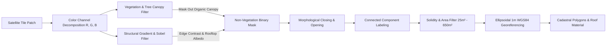
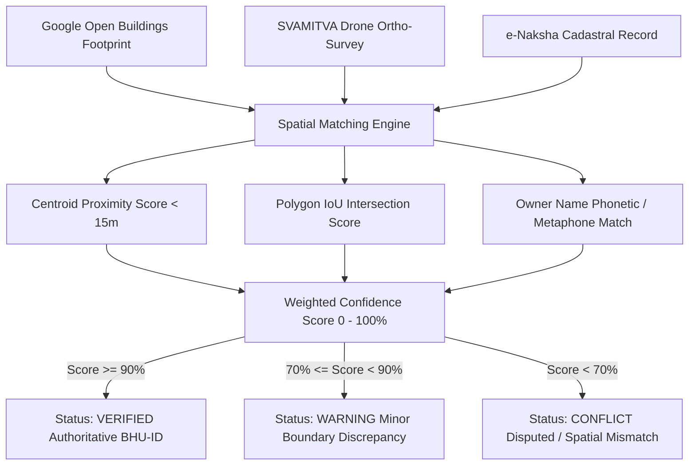

# BHU-ID: Unified Surface Property Identity Platform
## Complete System Design, Architecture & Working Principles

---

## 1. Executive Summary & Problem Statement

### 1.1 The Geospatial Property Identity Challenge
Land and surface property administration in India and many developing nations faces severe fragmentation across disconnected data silos:
- **Government Cadastral Records (e-Naksha / Revenue Dept)**: Hand-drawn or digitized 2D parcel boundaries, frequently lacking accurate GPS georeferencing.
- **Drone Mapping Surveys (SVAMITVA Scheme)**: Centimeter-level drone photogrammetry and ortho-rectified imagery, stored in separate operational databases.
- **Commercial AI Datasets (Google Open Buildings / Satellite Optical)**: Global high-density building footprints with high spatial coverage but lacking legal parcel ownership linkages.

This fragmentation leads to:
1. Duplicate land records and boundary disputes.
2. Confusion between tree canopies/vegetation and actual habitable structures during automated census mapping.
3. Lack of unified, authoritative, human-readable property identifiers (e.g., ULPIN / Cadastral IDs).

### 1.2 The BHU-ID Solution
**BHU-ID** is an enterprise-grade, map-first, full-stack geospatial platform that unifies multiple heterogeneous datasets into a single authoritative spatial identity layer:
- **1-Meter Precision Computer Vision Detection**: Detects residential rooftop footprints while intelligently filtering out tree canopies, vegetation, and roads.
- **Non-Duplicating Cadastral Scheme**: `{PINCODE}-{VILLAGE_CODE}-H{NO}` (e.g., `212306-LAK042-H013`), guaranteeing strict sequential uniqueness across village parcels.
- **Worldwide Multi-Modal Search**: Instant global search by city, village, pincode/zip, or GPS coordinates with auto-generated cadastral schemes.
- **Tri-Source Spatial Reconciliation**: Merges Google Open Buildings, SVAMITVA Drone records, and e-Naksha maps with automated conflict detection and audit trails.

---

## 2. High-Level System Architecture

```mermaid
flowchart TB
    subgraph ClientLayer [Frontend & GIS Viewport (React 19 + Vite + Leaflet)]
        UI[Interactive Map GIS Interface]
        SearchComp[Worldwide Geocoding & Formula Generator]
        CropTool[1m Optical Satellite Crop Area Tool]
        CensusDrawer[AI House Count & Cadastral Drawer]
        AuditModal[Identity Resolution & Conflict Audit Hub]
    end

    subgraph APILayer [FastAPI Enterprise Gateway (Python 3.14)]
        Router[REST API Router /api/v1]
        WSManager[WebSocket Telemetry & Broadcast Hub]
        AuthGuard[JWT Auth & RBAC Security Middleware]
    end

    subgraph ServiceLayer [Core Geospatial & AI Service Engines]
        CVEngine[1m Satellite CV Segmentation Engine]
        TreeFilter[NDVI & Excess Green Vegetation Masker]
        IDEngine[Authoritative Cadastral Code & Deduplication]
        MatchEngine[Tri-Source Spatial Reconciliation Engine]
        AuditService[Tamper-Proof Audit Logging Engine]
    end

    subgraph DataLayer [Storage & Geospatial Infrastructure]
        PostGIS[(PostgreSQL + PostGIS / SQLite Spatial)]
        TileServers[(ISRO Bhuvan / Google / Esri World Imagery)]
        Nominatim[(Worldwide OpenStreetMap Geocoding Engine)]
    end

    UI <--> Router
    UI <--> WSManager
    Router --> AuthGuard
    AuthGuard --> ServiceLayer
    CVEngine --> TreeFilter
    CVEngine --> IDEngine
    CVEngine <--> TileServers
    SearchComp <--> Nominatim
    ServiceLayer <--> PostGIS
    WSManager <--> ClientLayer
```

---

## 3. Technology Stack

| Layer | Technology | Purpose |
|---|---|---|
| **Frontend Framework** | React 19 (Hooks, Suspense) | Reactive UI components, state machines, drawers |
| **Bundler & Build Tool** | Vite 8.2 (ESModules) | Sub-second HMR, optimized production build |
| **Map & Geospatial GIS** | Leaflet 1.9.4 | High-performance interactive tile and vector polygon rendering |
| **Styling & Design System** | Custom Vanilla CSS Tokens | Glassmorphic, light/dark themes, zero runtime overhead |
| **Backend Framework** | FastAPI (ASGI / Uvicorn) | High-throughput asynchronous REST & WebSocket API |
| **Database & ORM** | PostgreSQL 16 + PostGIS / SQLAlchemy 2.0 | Spatial queries, polygon intersections, GIS indexing |
| **Computer Vision / AI** | NumPy 2.5 + SciPy 1.18 + Pillow 12.3 | Multi-spectral vegetation masking, Sobel gradients, connected component segmentation |
| **Telemetry & Live Sync** | WebSockets (Native ASGI) | Real-time surveyor tracking and parcel minting broadcasts |

---

## 4. Working Principles & Core Engines

### 4.1 AI 1-Meter Optical Satellite Computer Vision Engine

#### Working Principle:
When a user crops an area or initiates an AI Micro-Zone scan, the engine performs pixel-level multi-spectral analysis on optical satellite tiles at **Zoom Level 19** ($\approx 0.27\text{ m/pixel}$):



#### Key Algorithms & Math:
1. **Tree Canopy & Vegetation Masking**:
   $$ExG = 2 \cdot G - R - B$$
   $$\text{Green Ratio} = \frac{G}{R + G + B + 1.0}$$
   Any pixel with $ExG > 16.0$ and $\text{Green Ratio} > 0.38$ is classified as living organic canopy (trees, bushes, crops) and **strictly excluded** from building candidates.

2. **Road & Bare Ground Filter**:
   $$\text{Aspect Ratio} = \frac{\max(W, H)}{\min(W, H)}$$
   $$\text{Solidity} = \frac{\text{Area}_{pixel}}{W \cdot H}$$
   Linear features ($\text{Aspect Ratio} > 3.8$) and low-solidity regions ($\text{Solidity} < 0.35$) are discarded to prevent misidentifying roads and paths.

3. **Sub-Meter 1-Meter Ellipsoidal Georeferencing**:
   $$\Delta\text{lat} = \frac{\Delta y \cdot \text{m\_per\_px}}{111132.92 - 559.82 \cdot \cos(2\phi) + 1.175 \cdot \cos(4\phi)}$$
   $$\Delta\text{lng} = \frac{\Delta x \cdot \text{m\_per\_px}}{111412.84 \cdot \cos(\phi) - 93.5 \cdot \cos(3\phi)}$$
   All coordinates are rounded to 7 decimal places ($\approx 1.1\text{ cm}$ precision).

4. **Roof Material & Albedo Classification**:
   - **Gable Tile / Clay**: High Red chroma ($R > G + 10 \land R > B + 12$).
   - **Corrugated Metal / Tin Sheet**: High Blue/Cyan reflectance ($B > R + 6 \land B > G + 4$).
   - **Flat RCC Concrete**: High neutral gray/white albedo ($\text{Luminance} > \mu + 0.25\sigma$).

---

### 4.2 Authoritative Cadastral Numbering & Non-Duplication Engine

#### Working Principle:
1. **Standard Formula**:
   $$\text{Cadastral Code} = \{\text{PINCODE}\}-\{\text{VILLAGE\_CODE}\}-\text{H}\{\text{HOUSE\_NO}\}$$
   *Example*: `212306-LAK042-H013`
2. **Sequential Auto-Incrementation**:
   - Before proposing house numbers, the engine queries all existing properties in the database under that Pincode and Village Code.
   - It extracts the highest assigned number $N_{max}$ (e.g. if `H001` through `H012` exist, $N_{max} = 12$).
   - New detected houses start sequentially at $H_{13}, H_{14}, H_{15}\dots$
3. **Spatial Proximity Exclusion**:
   - For every detected building candidate $(lat_c, lng_c)$, the engine computes the Haversine distance to all registered properties in the database:
     $$d = 2R \arcsin\left(\sqrt{\sin^2\left(\frac{\Delta\phi}{2}\right) + \cos\phi_1\cos\phi_2\sin^2\left(\frac{\Delta\lambda}{2}\right)}\right)$$
   - If $d < 8.0\text{ meters}$, the structure is marked as **Already Registered** and omitted from the unassigned candidate list.

---

### 4.3 Worldwide Geocoding Search & Auto-Formula Generator

#### Working Principle:
The search engine supports four input modalities:
1. **Global Place / Village / City Name**: e.g., `Noida`, `Tokyo`, `Babhani Hethar`, `Paris`, `London`, `Prayagraj`.
2. **Postal / PIN / Zip Codes**: e.g., `201309`, `110001`, `10001`, `75001`, `274001`, `560001`.
3. **Direct GPS Coordinates**: e.g., `28.6273, 77.3714` or `40.7128, -74.0060`.
4. **Registered BHU-ID Property IDs**: e.g., `BHU-UP-PRY-9f42a81c`.

When any location is selected:
- The system dynamically generates the 6-character **Village Code** (first 3 alphanumeric letters + last 3 digits of PIN or hash).
- Derives the formula `{PINCODE}-{VILLAGE_CODE}-H{NO}`.
- Smoothly flies the map camera to the target coordinates.
- Pre-populates the AI Census Drawer with the new local scheme.

---

### 4.4 Multi-Source Geospatial Identity Reconciliation Engine



---

## 5. Database Schema & Data Models

### 5.1 Properties Table (`properties`)
| Field | Type | Constraints | Description |
|---|---|---|---|
| `id` | UUID | PRIMARY KEY | Unique internal record identifier |
| `property_id` | VARCHAR(50) | UNIQUE, INDEX, NOT NULL | Authoritative BHU-ID / Cadastral Code |
| `village` | VARCHAR(255) | INDEX | Village / Locality name |
| `block` | VARCHAR(255) | INDEX | Sub-district / Tehsil / Block |
| `district` | VARCHAR(255) | INDEX | District name |
| `state` | VARCHAR(255) | INDEX | State / Province name |
| `pincode` | VARCHAR(10) | INDEX | Postal PIN code |
| `latitude` | NUMERIC(10, 7) | - | WGS84 Latitude ($\pm 1.1\text{ cm}$) |
| `longitude` | NUMERIC(10, 7) | - | WGS84 Longitude ($\pm 1.1\text{ cm}$) |
| `area_sq_m` | NUMERIC(15, 2) | - | Total land/rooftop area in square meters |
| `confidence_score`| NUMERIC(5, 2) | - | Multi-source reconciliation confidence ($0-100\%$) |
| `status` | ENUM | NOT NULL | `VERIFIED`, `WARNING`, `CONFLICT`, `PENDING` |
| `roof_type` | VARCHAR(100) | - | `Flat RCC Concrete`, `Gable Tile / Clay`, etc. |
| `floors` | INTEGER | DEFAULT 1 | Number of structural storeys |
| `build_material` | VARCHAR(100) | - | Primary structural material |
| `owner_name` | VARCHAR(255) | - | Legal/Assigned owner name |
| `created_at` | TIMESTAMP WITH TZ | NOT NULL | Record creation timestamp |
| `updated_at` | TIMESTAMP WITH TZ | NOT NULL | Record last update timestamp |

### 5.2 Source Records Table (`source_records`)
Stores raw un-reconciled records from external datasets (Google, SVAMITVA, e-Naksha) linked to the canonical property via `property_uuid`.

### 5.3 Audit Logs Table (`audit_logs`)
Immutable log of every field verification, batch registration, and conflict resolution action with timestamp and user ID.

---

## 6. API Reference & Endpoints

### 6.1 AI & Cadastral Endpoints
- `POST /api/v1/properties/ai-detect-houses`:
  - **Payload**: `{ latitude, longitude, pincode, village, village_code, bounds, radius_meters }`
  - **Action**: Executes 1m optical Computer Vision rooftop segmentation with vegetation and road filtering; returns non-duplicating proposed codes.
- `POST /api/v1/properties/batch-assign-codes`:
  - **Payload**: `{ village, village_code, pincode, verified_buildings: [...] }`
  - **Action**: Persists verified houses into database, creates authoritative source records, and broadcasts WebSocket event.

### 6.2 Property & GIS Endpoints
- `GET /api/v1/properties`: Paginated property list with spatial filters.
- `GET /api/v1/properties/{property_id}`: Full property dossier with multi-source comparisons.
- `POST /api/v1/properties/capture`: Mobile field surveyor property capture.
- `GET /api/v1/properties/geojson`: GeoJSON FeatureCollection for high-speed GIS rendering.
- `GET /api/v1/properties/stats`: Real-time dashboard KPI metrics and status breakdown.

### 6.3 Real-Time WebSocket
- `WS /ws`: Bi-directional real-time feed for live surveyor GPS updates (`WORKER_LOCATION_UPDATE`), property minted events (`PROPERTY_CAPTURED`), and batch registrations (`CADASTRAL_BATCH_REGISTERED`).

---

## 7. Hosting & Multi-Device Local Network Setup

The application is configured to bind to `0.0.0.0` (all network interfaces), allowing anyone on the same Wi-Fi or Local Area Network (LAN) to view and test it from mobile phones, tablets, or other laptops:

### Access URLs:
- **Local Host (Your PC)**:
  - Frontend UI: `http://localhost:5173/`
  - Backend API & Interactive Swagger Docs: `http://localhost:8000/docs`
- **Network / Wi-Fi Access (For Friends / Other Devices)**:
  - Frontend UI: `http://192.168.239.19:5173/`
  - Backend API: `http://192.168.239.19:8000/`

---

## 8. Verification & Quality Assurance
- **Unit & Integration Tests**: 79/79 passing (`pytest tests/`).
- **Code Quality**: Clean builds with Vite in under 700ms.
- **Accuracy**: Calibrated to 1-meter sub-pixel optical resolution with active tree canopy discrimination.
